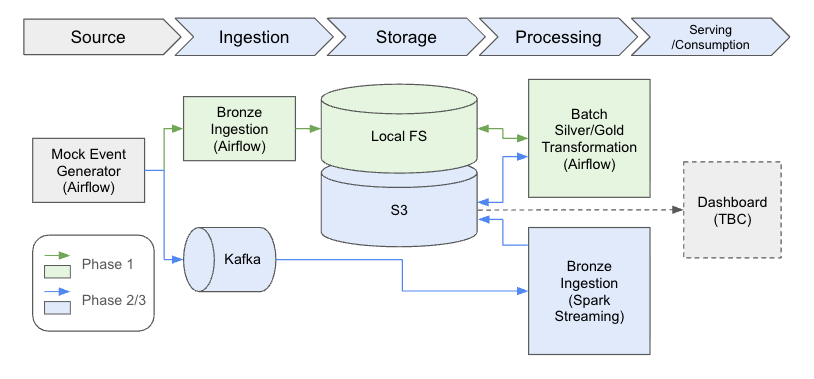
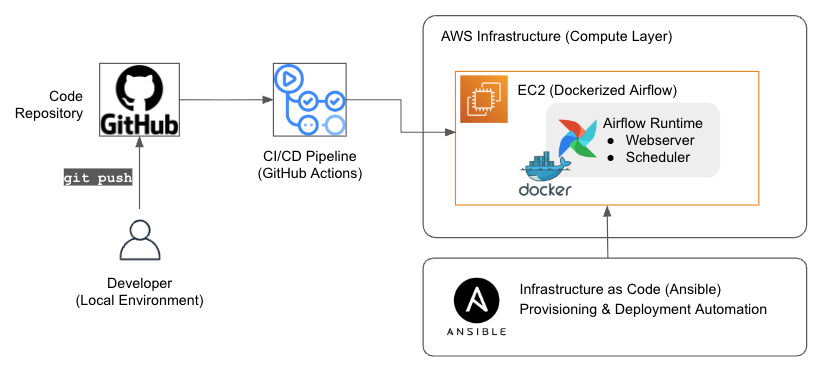

# SaaS Subscription Lifecycle Data Platform

This project builds an event-driven data platform that models subscription lifecycle events, 
ingests them into a medallion architecture, and incrementally transforms them into reliable analytical datasets.

It starts as a batch-based pipeline orchestrated with Airflow 
and is designed to evolve into a real-time streaming system using Kafka and Spark,
with minimal changes to the core data model and storage layout.

## Key Features

- Event-driven lifecycle modeling (append-only, no overwrites)
- Incremental & idempotent processing (watermark + deduplication)
- Medallion architecture (Bronze → Silver → Gold)
- Deterministic state reconstruction (history → current snapshot)
- Designed for batch-to-streaming evolution

## Architecture

### Data Flow (Phase 1)

The platform processes subscription lifecycle events through a layered medallion architecture using an incremental, state-aware pipeline.

1. **Source (Event Generation)**
   - Mock event generator simulates subscription lifecycle events
2. **Ingestion (Airflow)**
   - Events are written to Bronze layer as JSONL files
   - Partitioned by ingestion date (`dt=YYYY-MM-DD`)
3. **Storage (Local FS)**
   - Local filesystem used as S3-compatible structure for seamless migration to object storage 
4. **Processing (Airflow)**
   - Incremental Bronze → Silver transformation
     - Builds:
       - Silver History
         - Events are transformed into a canonical subscription state history, deduplicated using `event_id` for idempotency
         - State is reconstructed by ordering events using `event_time` and `ingested_at`
         - Data is stored as **partitioned Parquet files (`dt=YYYY-MM-DD`)**
         - Only **affected partitions are re-written**
       - Silver Current
         - A latest subscription snapshot is derived from the full history table
         - For each `subscription_id`, the most recent event is selected
         - This table represents the **current state of all subscriptions**
5. **Serving (Gold Layer)**
   - Daily KPIs are derived from event-driven state reconstruction (history table)
     - `new_subscriptions`, `new_cancellations`, `MRR`
   - Incremental logic:
     - New data is detected via `ingested_at` watermark
     - The earliest affected `event_date` is identified
     - KPIs are recomputed **only from that date onward**
   - Results are stored as partitioned Parquet (`dt=YYYY-MM-DD`)

### Development & Deployment
- **Code Versioning (GitHub)**
- **CI/CD Pipeline (GitHub Actions)**
- **Infrastructure (AWS EC2)**
  - Compute layer hosting the data platform
- **Configuration (Ansible)**
  - Provision EC2 instance
  - Install Docker and dependencies 
  - Deploy Airflow environment
- **Runtime (Dockerized Airflow)**
  - Orchestrates data pipelines

## Key Decisions

### 1. **A stateful event generator**
- The event generator maintains lifecycle state and produces only allowed next actions
- This moves beyond predefined test cases and helps uncover unexpected edge scenarios

### 2. Incremental Processing via Watermarks
- All layers process data incrementally using an `ingested_at` watermark
- Enables efficient updates without full recomputation

### 3. Partition-Level Update & Partial Recompute
- To build silver history only affected partitions are reloaded and overwritten
- Gold KPIs are recomputed only from the earliest affected date
- Balances correctness (late events) with efficiency (avoiding full rewrites)
- Handles late-arriving events via partition-level recompute

### 4. Event-Sourced State Reconstruction
- Subscription state is derived from event history, not stored directly
- Ensures deterministic, reproducible state and supports late-arriving data

### 5. Idempotent Processing via Event Deduplication
- Duplicate events are removed using `event_id`
- Guarantees safe reprocessing and retry behavior

### 6. Batch-First, Streaming-Ready Design
- Built with batch (Airflow + files) but mirrors streaming concepts
- Designed for extension to Kafka/Spark without redesign

## Future Work

### Phase 2 - Cloud & Data Quality
- Migrate storage from local filesystem to AWS S3
- Introduce schema validation layer 
- Add data quality checks and monitoring

### Phase 3 - Streaming & Real-time Processing
- Introduce Kafka-based event ingestion
- Build streaming pipeline with Spark Structured Streaming
- Transition to table formats like Apache Iceberg
- Support real-time dashboards and near real-time analytics
