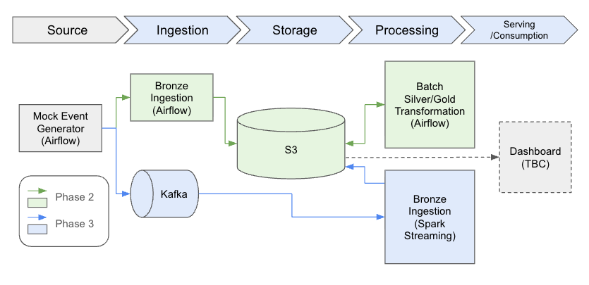

# SaaS Subscription Lifecycle Data Platform

This project builds an event-driven data platform that models subscription lifecycle events,
stores them in an S3-backed medallion data lake, and incrementally transforms them into reliable analytical datasets.

It starts as a batch-based pipeline orchestrated with Airflow 
and is designed to evolve into a real-time streaming system using Kafka and Spark,
with minimal changes to the core data model and storage layout.


## Key Features

- Stateful event generator for realistic lifecycle simulation
- Incremental processing using `ingested_at` watermarks
- Partition-aware recomputation for late-arriving events
- Event-sourced state reconstruction (history → current snapshot)
- Idempotent processing via event deduplication (`event_id`)
- S3-backed data lake with environment-agnostic storage abstraction
- Layered data validation across Bronze, Silver, and Gold
- Cross-layer consistency checks between KPIs and reconstructed state
- Designed for batch-first execution with a clear path to streaming (Kafka/Spark)


## Architecture Overview



> Originally built as a local batch pipeline (Phase 1), the system has evolved into an S3-backed data lake architecture (Phase 2).


## Data Flow

The platform processes subscription lifecycle events through a layered medallion architecture using an incremental, state-aware pipeline.

1. **Source (Event Generation)**
   - Mock event generator simulates subscription lifecycle events
2. **Ingestion (Airflow)**
   - Events are written to Bronze layer as JSONL files
   - Partitioned by ingestion date (`dt=YYYY-MM-DD`)
3. **Storage (S3 Data Lake)**
   - Data is stored in an S3-backed object storage system
   - A storage abstraction layer allows seamless switching between local filesystem and S3
4. **Processing (Airflow)**
   - Incremental Bronze → Silver transformation using `ingested_at` watermark
     - Builds:
       - Silver History
         - Events are transformed into a canonical subscription state history
         - Deduplicated using `event_id` for idempotency
         - State is reconstructed using `event_time` and `ingested_at`
         - Data is stored as partitioned Parquet files (`dt=YYYY-MM-DD`, event date)
         - Only affected partitions are re-written
         - State validation ensures ordering and consistency
       - Silver Current
         - Latest subscription snapshot derived from full history
         - One record per `subscription_id`
         - Represents the current state of all subscriptions
5. **Serving (Gold Layer)**
   - Daily KPIs are derived from event-driven state reconstruction (history table)

   - Incremental logic:
     - New data is detected via `ingested_at` watermark
     - The earliest affected `event_date` is identified
     - KPIs are recomputed **only from that date onward**
   - Metrics are categorized into:
     - **Flow metrics (event counts)**:
       - `new_subscriptions`: daily count of `subscription_created` events
       - `new_cancellations`: daily count of `subscription_cancelled` events
     - **Stock metrics (state snapshot as of end-of-day)**:
       - `active_subscriptions`: count of subscriptions whose latest status is `active`
       - `mrr`: total MRR from subscriptions whose latest status is `active`
   - Results are stored as partitioned Parquet (`dt=YYYY-MM-DD`)


## Development & Deployment


- **Code Versioning (GitHub)**
- **CI/CD Pipeline (GitHub Actions)**
- **Infrastructure (AWS EC2)**
  - Compute layer hosting the data platform
  - Attached IAM role for secure S3 access
- **Storage (AWS S3)**
  - Data lake for Bronze, Silver, and Gold layers
- **Networking**
  - Elastic IP for stable public access to Airflow UI
- **Configuration (Ansible)**
  - Provision EC2 instance
  - Install Docker and dependencies 
  - Deploy Airflow environment
- **Runtime (Dockerized Airflow)**
  - Orchestrates data pipelines


## Key Decisions

#### 1. **A stateful event generator**
- The event generator maintains lifecycle state and produces only allowed next actions
- This moves beyond predefined test cases and helps uncover unexpected edge scenarios

#### 2. Incremental Processing via Watermarks
- All layers process data incrementally using an `ingested_at` watermark
- Bronze appends new events, while Silver and Gold selectively recompute affected data
- Enables efficient updates without full recomputation

#### 3. Partition-Level Update & Partial Recompute
- To build Silver history, only affected partitions are reloaded and overwritten
- Gold KPIs are recomputed only from the earliest affected date
- Handles late-arriving events without full table rewrites
- Trades storage efficiency for correctness and simplicity

#### 4. Event-Sourced State Reconstruction
- Subscription state is derived from event history, not stored directly
- Ensures deterministic, reproducible state and supports late-arriving data

#### 5. Idempotent Processing via Event Deduplication
- Duplicate events are removed using `event_id`
- Ensures idempotent processing and safe retries across pipeline runs

#### 6. Batch-First, Streaming-Ready Design
- Built with batch (Airflow + files) but mirrors streaming concepts
- Designed for extension to Kafka/Spark without redesign

#### 7. Storage Abstraction for Environment-Agnostic Pipelines
- Introduced a storage interface to decouple pipeline logic from underlying storage
- Supports both local filesystem and S3 without changing transformation code
- Enables seamless transition from local development to cloud data lake

#### 8. Layered Data Validation
- Validation is applied at each layer with increasing strictness
- Bronze: schema enforcement and basic integrity checks
- Silver: state correctness and historical consistency
- Gold: business-level validation and cross-layer consistency checks
  - Gold KPIs (e.g., active subscriptions, MRR) are validated against the Silver current snapshot
  - Ensures aggregate metrics remain consistent with the underlying state


## Project Structure

```text
.
├── .github/
│   └── workflows/
│       └── deploy-airflow.yml
├── dags/
├── docs/
│   ├── architecture/
│   └── reflections/
├── infra/
│   └── ansible/
│       └── playbooks/
│           ├── bootstrap.yml
│           ├── deploy-airflow.yml
│           └── init-airflow.yml
├── src/
│   ├── common/
│   ├── gold/
│   ├── ingestion/
│   └── silver/
├── tests/
├── docker-compose.airflow.yml
├── README.md
└── requirements.txt
```

## Future Work for Phase 3

#### 1. Streaming Ingestion (Kafka)
- Replace batch-based ingestion with real-time event streaming using Kafka
- Introduce a consumer service to write events into the Bronze layer
- Enable near real-time state updates while preserving the existing data model

#### 2. Distributed Processing (Spark)
- Scale transformation logic using Spark for larger datasets
- Maintain the same medallion structure while improving performance and parallelism

#### 3. Table Format Upgrade (Apache Iceberg)
- Introduce Iceberg for efficient incremental updates and partition management
- Reduce full partition rewrites and enable ACID-like guarantees on the data lake

#### 4. Observability & Data Applications (Grafana)
- Integrate Grafana for monitoring pipeline health and data quality
- Visualize key KPIs (e.g., MRR, active subscriptions) in real time
- Add alerting for pipeline failures, data anomalies, and freshness issues
